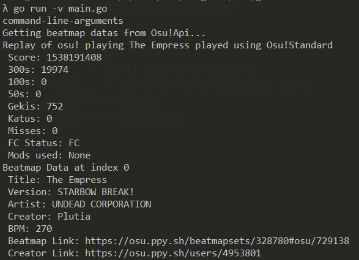

OsrParser
----

[](https://github.com/fauzanardh/OsrParser) [](https://opensource.org/licenses/MIT) [](https://golang.org/dl/)


Osu! Replay parser build with GO version 1.11 (modified for personal use)


Refrence
----

- BinaryReader : [Mempler's Repo](https://github.com/Mempler/osubinary/)
- ULEB128      : [Bnch's Repo](https://github.com/bnch/uleb128/)

Usage
----

 **First of all**
 install lzma package from [Itchio's Repo](https://github.com/itchio/lzma)

 `go get github.com/itchio/lzma`

 and then install this package

 `go get github.com/fauzanardh/OsrParser`

 (optional) add your osu!api apikey to get the beatmap data, edit the APIKEY from `$GOPATH/src/github.com/fauzanardh/OsrParser/constants.go`

 **How to use**
 ```go
 package main

 import (
 	"io/ioutil"

 	"github.com/fauzanardh/OsrParser"
 )

 func main() {
 	buffer, _ := ioutil.ReadFile("rep.osr")
 	replay, _ := OsrParser.ParseReplay(buffer, false)
 	replay.PrintReplay()
 	replay.PrintAllBeatmap()
 }
 ```

 Screenshot
 ----
 

Author
----
[@Fauzanardh](https://github.com/fauzanardh)
